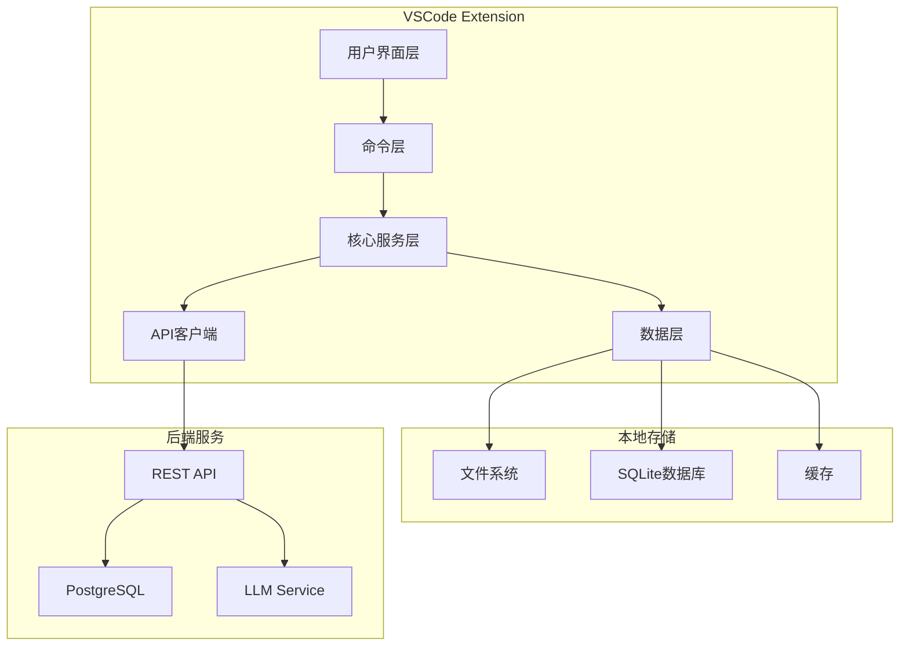
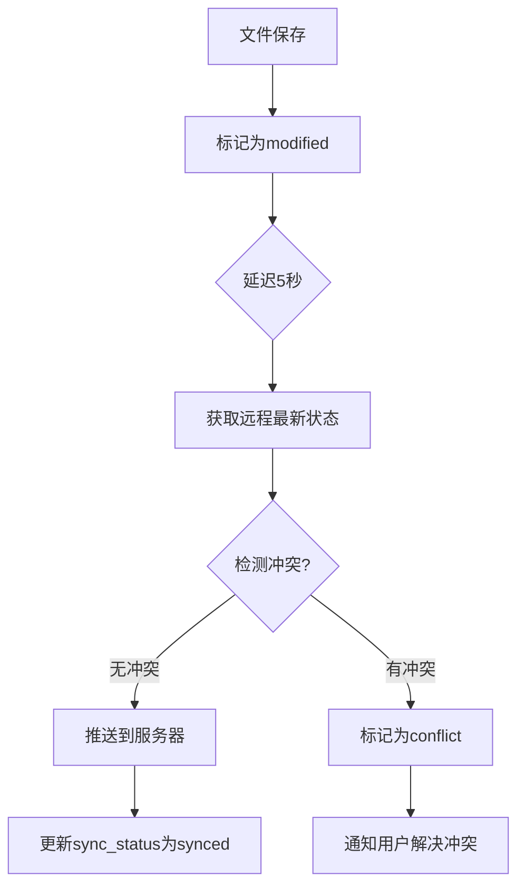
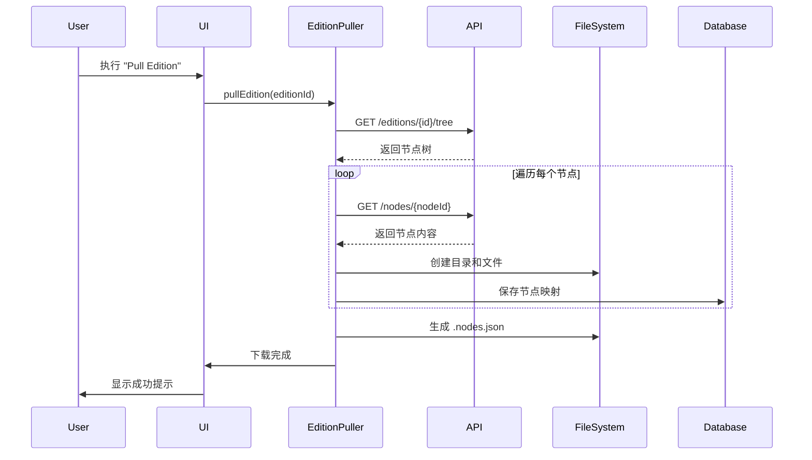
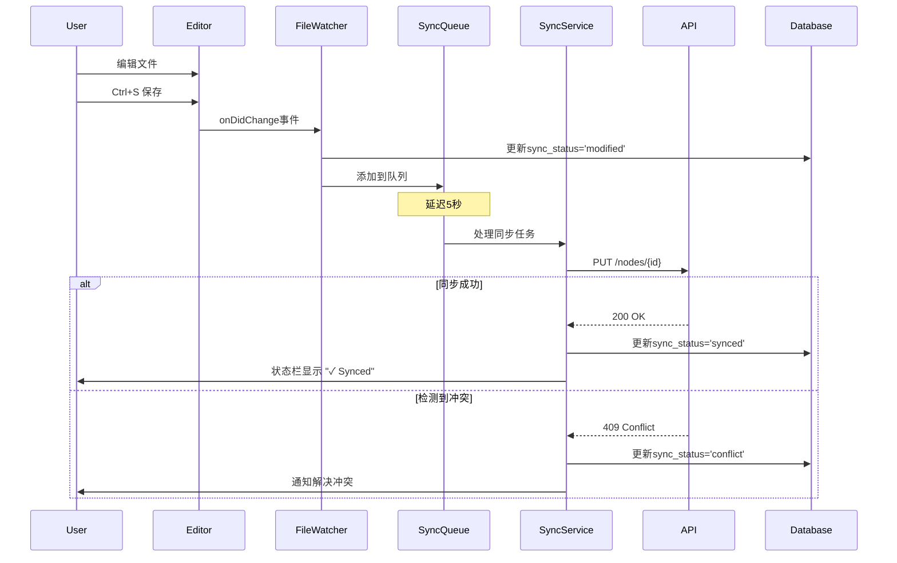
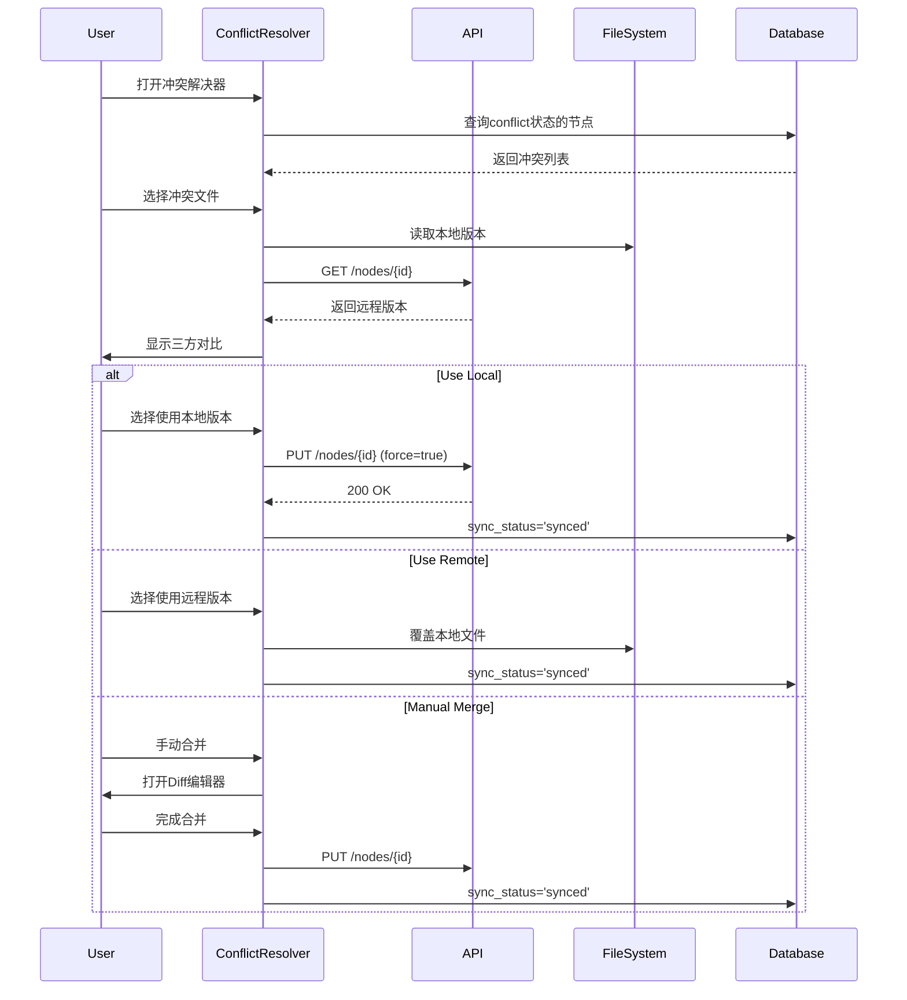
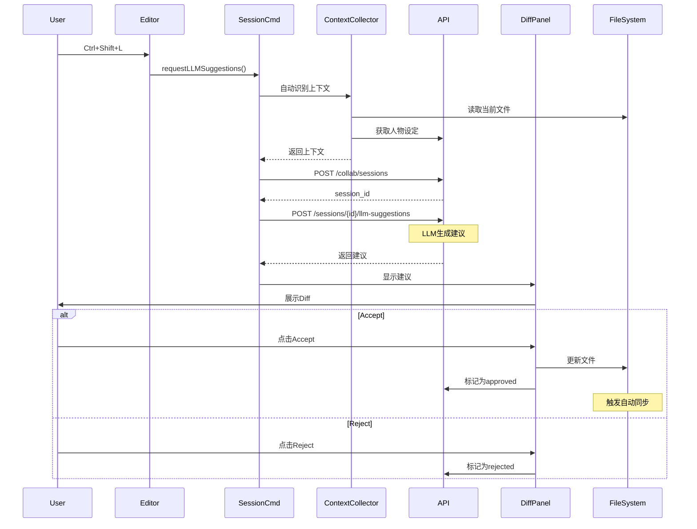
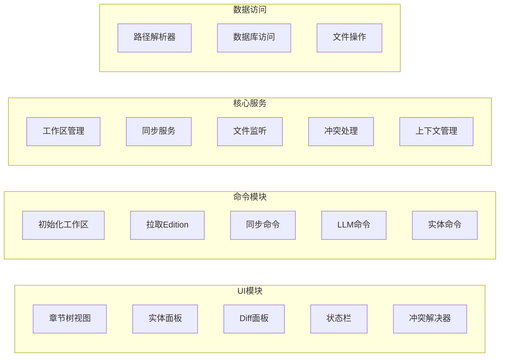

# Editor

早期版本的SailZen-Editor会使用vscode-plugin形式进行开发，理由如下

- vscode本身是非常成熟的编辑器，大多数人比较容易上手
- vscode具有大量webview功能，拥有不亚于web本身的交互上限
- vscode已经被大量用作LLM辅助代码开发的编辑器
  
其中最重要的是第三点，在世界观梳理和长篇小说创作的过程很大程度上是工程化的，需要无时无刻地照应前后文语境，检索必要的设定，修复逻辑冲突的部分，和代码的开发有很多相似之处。所以，基于LLM的世界观创作功能必然也需要大量参考当前基于LLM的代码工具开发。而无论是和新版本一同更新并最终开源的copilot插件，还是从vscode高度定制的cursor，都给很多LLM辅助小说编辑的功能开发提供了必要的脚手架和现成的参考。在当前LLM工具还没有成熟范式的情况下，先行者的经验极为宝贵。如果采用web另起炉灶，则在早期需要花费过多精力在不必要的基础功能范式和编辑功能上。

## 1. 背景与目标

- **来源**：系统的数据层设计见 `doc/design/DATA.md`，已定义作品、文本节点、实体/关系/事件及批次化处理模型。
- **目标**：打造一个 VSCode 插件形态的小说编辑器，使人类作者与 LLM 可以在同一文本上轮流创作、润色，并同步梳理人物关系与世界观知识。
- **原则**：
  - 双向协作：LLM 负责生成建议、校对、总结；人类掌控最终稿与世界观关键决策。
  - 实时溯源：所有修改、建议、知识项都能回溯到 `document_nodes` / `text_spans`。
  - 轻量融入：以 VSCode 插件模式实现最小侵入，复用熟悉的编辑体验。
  - 可扩展：预留扩展面向多作品、多作者、多人协作的能力。

## 2. 用户角色与核心场景

- **创作者（Author）**：编写小说正文、触发 LLM 辅助写作、管理章节大纲。
- **世界观整理者（Lore Editor）**：校对人物设定、管理实体关系、编写时间线。
- **审稿人 / 主编（Reviewer）**：审核 LLM 或作者提交的改动，决定入库。
- 在初始版本中，三个用户角色可以默认为同一人，方便全栈开发

关键场景：
1. 章节交替创作：作者撰写一段内容 → 请求 LLM 给出续写/润色 → 选择接受或微调 → 形成批次化改动。
2. 设定即时追踪：在编辑过程中查看/新增人物设定、关系图、事件节点。
3. 勘误与回滚：对历史改动进行比较、批注，并触发 `change_sets` 审核流程。
4. 上下文快速导航：跨卷/跨章节定位引用段落，构建 LLM 提示上下文。


## 3. 核心能力概览

- **交替创作循环**：提供“作者回合”和“LLM 回合”状态机，显式记录每次调用和采纳。
- **知识面板联动**：在侧边栏展示 `entities`、`entity_relations`、`narrative_events`，并支持就地创建或关联 `text_spans`。
- **上下文管理**：通过缓存 `document_nodes` 树与局部片段，生成 LLM 提示模板与引用。
- **批次化提交**：将一次交互视作 `annotation_batch`，记录建议、人工修改与最终入库的差异。
- **多模视图**：正文编辑器 + 大纲树 + 关系图 Webview + 时间线视图。
- **可观测性**：记录调用模型、耗时、接受率，用于优化提示与版本控制。



### 3.1 工作区管理

```
{workspace_root}/
├── .sailzen/
│   ├── config.json              # 工作区配置
│   ├── sync-state.db            # SQLite同步状态数据库
│   └── cache/                   # 本地缓存
│       ├── editions/            # edition元数据
│       └── entities/            # 实体数据缓存
├── editions/
│   ├── {edition_display_name}/
│   │   ├── .edition.json        # Edition元数据
│   │   ├── volume_01/
│   │   │   ├── chapter_01.md
│   │   │   ├── chapter_02.md
│   │   │   └── .nodes.json      # 节点ID映射
│   │   └── volume_02/
│   │       └── ...
│   └── {another_edition_display_nam}/
│       └── ...
└── README.md                     # 工作区说明文档
```

#### 3.1.1 工作区初始化


**命令**: `SailZen: Initialize Workspace`

**流程**：
1. 提示用户选择工作区根目录（或使用当前VSCode workspace）
2. 创建`.sailzen`目录结构
3. 提示用户输入后端服务URL（默认：`http://localhost:8000/api/v1`）
4. 保存配置到`.sailzen/config.json`
5. 初始化SQLite数据库`.sailzen/sync-state.db`

**配置文件格式** (`.sailzen/config.json`):
```json
{
  "version": "1.0",
  "backend_url": "http://localhost:8000/api/v1",
  "user_id": "user_uuid_or_email",
  "last_sync": "2025-01-15T10:30:00Z",
  "sync_enabled": true,
  "auto_sync_interval": 30,
  "conflict_strategy": "prompt"
}
```
#### 3.1.2 加载Edition到本地

**命令**: `SailZen: Pull Edition`

**流程**：
1. 从章节树视图点击"+"图标，或执行命令
2. 弹出Edition选择器（QuickPick），显示用户有权访问的所有editions
   - 从后端API获取：`GET /works/{work_id}/editions` 或 `GET /editions?accessible=true`
   - 显示：`[作品名称] Edition: {edition_title} (Last Updated: {date})`
3. 用户选择后，开始下载：
   - 调用 `GET /editions/{id}/tree` 获取节点树
   - 调用 `GET /nodes/{node_id}` 获取每个节点的完整内容
   - 按层级创建本地目录和Markdown文件
   - 保存节点ID映射到`.nodes.json`
4. 下载完成后：
   - 刷新章节树视图
   - 在状态栏显示"✓ Edition loaded: {edition_title}"
   - 自动打开Edition根目录

**Edition元数据文件** (`.edition.json`):
```json
{
  "id": "edition_uuid",
  "work_id": "work_uuid",
  "title": "Edition Title",
  "version": "1.0",
  "last_pulled": "2025-01-15T10:30:00Z",
  "last_pushed": "2025-01-15T10:25:00Z",
  "remote_updated_at": "2025-01-15T10:00:00Z"
}
```

**节点映射文件** (`.nodes.json`):
```json
{
  "nodes": [
    {
      "id": "node_uuid_1",
      "file_path": "volume_01/chapter_01.md",
      "title": "第一章：起始",
      "node_type": "chapter",
      "parent_id": "parent_node_uuid",
      "order_index": 1,
      "remote_updated_at": "2025-01-15T09:00:00Z",
      "local_updated_at": "2025-01-15T10:20:00Z",
      "sync_status": "synced|modified|conflict"
    }
  ]
}
```

### 3.2 章节树视图增强


#### 3.2.1 显示本地Editions

**视图结构**：
```
SailZen Chapters
├── 📚 My First Novel - v1.0 [synced]
│   ├── 📖 Volume 1
│   │   ├── 📄 Chapter 1: Beginning
│   │   └── 📄 Chapter 2: Journey
│   └── 📖 Volume 2
│       └── ...
├── 📚 Another Story - draft [modified*]
│   └── ...
└── ➕ Pull Edition from Server
```

**状态图标**：
- ✓ (绿色勾): 已同步
- ↑ (黄色箭头): 有本地修改待上传
- ⚠️ (红色警告): 有冲突待解决
- ⟳ (蓝色旋转): 正在同步

#### 3.2.2 右键菜单

**Edition级别菜单**：
- `Open in Explorer`: 在文件浏览器中打开edition目录
- `Sync Now`: 立即执行双向同步
- `Pull Changes`: 从服务器拉取更新
- `Push Changes`: 推送本地修改到服务器
- `Show Sync Status`: 显示同步详情
- `Remove Local Copy`: 删除本地副本（不影响服务器）

**节点（章节）级别菜单**：
- `Open`: 在编辑器中打开
- `Reveal in Explorer`: 在文件浏览器中定位
- `View Remote Version`: 查看服务器上的版本
- `Compare with Remote`: 对比本地和远程版本
- `Resolve Conflicts`: 解决冲突（仅在有冲突时显示）

### 3.3 文件编辑与自动同步

#### 3.3.1 文件监听

- 监听`editions/`目录下所有`.md`文件的变化
- 使用VSCode的`FileSystemWatcher`监听文件保存事件
- 在`.nodes.json`中更新`local_updated_at`和`sync_status`

#### 3.3.2 自动同步策略

**触发条件**：
1. 文件保存后5秒（debounce）
2. 用户手动执行同步命令
3. 定时任务（默认每30秒检查一次）
4. 编辑器失去焦点时

**同步流程**：


**API调用**：
1. **检查远程状态**: `GET /nodes/{node_id}`
   - 比较`updated_at`与本地记录的`remote_updated_at`
2. **推送修改**: `PUT /nodes/{node_id}`
   ```json
   {
     "raw_text": "文件内容",
     "updated_at": "本地记录的remote_updated_at"
   }
   ```
3. **处理响应**：
   - 200: 成功，更新`remote_updated_at`
   - 409 Conflict: 检测到冲突，进入冲突解决流程

#### 3.3.3 状态栏指示器

在VSCode状态栏显示同步状态：
```
[SailZen] ✓ Synced | ↑ 3 pending | ⚠️ 1 conflict
```

点击后显示详细信息面板。

### 3.4 冲突检测与解决


#### 3.4.1 冲突场景
- 本地修改了文件A，同时服务器上文件A也被其他客户端修改
- 检测依据：本地记录的`remote_updated_at` < 服务器实际`updated_at`

#### 3.4.2 冲突解决UI

**命令**: `SailZen: Resolve Conflicts`

**流程**：
1. 显示所有冲突文件列表（QuickPick）
2. 用户选择一个文件
3. 打开三方对比视图：
   - **Local**: 本地版本
   - **Remote**: 服务器版本
   - **Base**: 最后同步的版本（如果有）
4. 提供操作选项：
   - `Use Local`: 覆盖服务器版本
   - `Use Remote`: 丢弃本地修改
   - `Manual Merge`: 手动合并（使用VSCode内置merge编辑器）

#### 3.4.3 冲突解决命令

**WebView面板**: "Conflict Resolution"

```
╔═══════════════════════════════════════════════════╗
║ Conflict: chapter_01.md                           ║
║ Local modified: 2025-01-15 10:20                  ║
║ Remote modified: 2025-01-15 10:18                 ║
╠═══════════════════════════════════════════════════╣
║ [Use Local]  [Use Remote]  [Manual Merge]        ║
╚═══════════════════════════════════════════════════╝
```

### 3.5 离线支持

#### 3.5.1 离线模式检测
- 定期ping后端服务（每10秒）
- 检测到离线时，在状态栏显示"🔴 Offline Mode"

#### 3.5.2 离线编辑
- 所有编辑操作正常进行
- 标记所有修改为`pending_upload`
- 保存修改队列到`.sailzen/sync-state.db`

#### 3.5.3 重新上线
- 检测到网络恢复时，自动执行同步
- 按时间顺序上传所有pending修改
- 显示同步进度通知

### 3.6 实体浏览器

- 记住上次查看的edition_id，下次打开自动加载
- 在面板顶部显示当前edition选择器
- 支持实时搜索过滤
- 双击实体：打开实体详情编辑器
- 拖拽实体到编辑器：插入实体引用标记（如`@张三`）
- 在文本中识别实体：高亮显示已识别的实体

#### 3.6.1 实体提及跳转

**功能**: 点击实体面板中的实体，跳转到文本中的提及位置

**实现**：
1. 调用 `GET /entities/{entity_id}/mentions`
2. 根据`span_id`获取对应的`node_id`
3. 查找本地文件路径（通过`.nodes.json`）
4. 打开文件并定位到对应位置（使用`start_char`和`end_char`）
5. 高亮显示提及文本

#### 3.6.2 在编辑器中标注实体

**命令**: `SailZen: Mark as Entity`

**流程**：
1. 用户在编辑器中选中文本
2. 执行命令，弹出QuickPick：
   - 搜索现有实体（可模糊搜索）
   - 或"+ Create New Entity"
3. 选择或创建实体后：
   - 调用API创建`entity_mention`
   - 在本地文件中插入标记（可选，如`@[entity_name](entity:uuid)`）
   - 更新实体面板


## 4. 端到端流程

1. 插件加载作品：调用后端 RESTful API（参考 `doc/design/BACKEND.md`）获取 `works`、`editions`、`document_nodes` 结构。
2. 建立本地会话缓存：使用 SQLite/IndexedDB（Webview）存储当前章节节点、`text_spans`、上下文向量。
3. 作者选择章节并进入交替创作模式：
   - 进入“作者回合”状态，编辑器跟踪 diff 与光标。
   - 触发命令 `LLM: Suggest Continuation` 进入“LLM 回合”，插件向 LLM Orchestrator 提交请求（携带上下文、指令、约束、世界观事实）。
4. LLM 返回建议：
   - 在内嵌 diff 面板展示 → 作者可“接受全部”“拆分接受”或“拒绝”。
   - 采纳后生成 `change_items` 草稿并写入临时缓存。
5. 作者提交批次：插件汇总本轮 session → 发送至后端，生成 `annotation_batches` + `annotation_items` + `change_sets`。
6. 审稿流程：后端触发 `review_tasks`，可在 VSCode `Review` 面板中完成审批。
7. 同步更新：审核通过后刷新本地缓存，更新大纲与知识面板。

### 4.1 Edition 下载流程


### 4.2 文件编辑于同步流程




### 4.3 冲突解决流程



### 4.4 LLM辅助创作流程




## 5. 组件架构

### 5.1 VSCode 侧

- **Extension Host (TypeScript)**：注册命令、TreeView（章节树、人物列表）、Notebook/Custom Editor 等 API。
- **Story Webview Panel**：基于 React，在 Webview 中提供富 UI（交替编辑面板、LLM 建议列表、关系图）。
- **Graph/Timeline Webview**：使用 d3.js 在 VSCode Webview 内渲染多种视角（时间轴、关系树、地理拓扑），无需三维组件。
- **State Manager**：采用 Zustand管理前端状态，支持 session storage。
- **Local Cache**：使用 `vscode.workspaceState` + IndexedDB (Webview) 存储最近章节、模型结果、临时批次。



### 5.2 服务端

- **API Gateway**：
  - 基于 FastAPI 的 RESTful 接口（详见 `doc/design/BACKEND.md`），提供 `GET /editions/{id}/nodes`、`POST /collab/sessions` 等资源。
  - 提供批次写入接口（如 `POST /collab/sessions/{id}/commit`）写入 `annotation_batches`, `change_sets`。
- **LLM Orchestrator**：
  - 封装对标准网络服务模型（Gemini / Claude / GPT / DeepSeek / Qwen）的调用，支持超时、断线重试和流式返回。
  - 负责 prompt 模板化、上下文拼接（大纲摘要、人物设定）。
- **Collaboration Service (可选)**：基于 WebSocket/SSE 推送他人操作、审核结果。
- **PostgreSQL**：按照数据设计落地，记录所有结构化信息。

### 5.3 Monorepo 工程结构

- 采用 `SailZen` monorepo：
  - `server/`：FastAPI 服务实现 `doc/design/backend.md` 描述的 REST API。
  - `extension/`：VSCode 插件工程（TypeScript + pnpm）。
- 共享资源：
  - `packages/shared-schemas/`：OpenAPI Schema、Pydantic/Zod 类型同步前后端协议。
  - `packages/prompt-templates/`：Prompt YAML、上下文拼装工具函数。
- CI 统一在仓库根目录运行 lint/test/build，并在发布前校验 REST 契约与插件类型兼容性。

## 6. 数据交互与表映射

| 插件操作 | 数据表 / 资源 | 说明 |
| --- | --- | --- |
| 加载章节树 | `document_nodes` | 获取 `edition_id` 下的树形节点 `path`、`node_type`、`title`。
| 获取正文片段 | `text_spans` | 根据节点 ID 拉取段落、句子，并回填 `text_snippet` 至编辑器。
| 生成 LLM 上下文摘要 | `node_text_stats`, `entity_mentions` | 提供统计、引用信息；必要时调用 `embedding_vector` 做相似段匹配。
| 创建人物/设定 | `entities`, `entity_attributes` | 绑定 `span_id`，记录新增设定或属性。
| 管理关系 | `entity_relations`, `relation_evidence` | 通过 Webview 表单创建/更新关系，提交证据 span。
| 记录事件 | `narrative_events`, `event_participants` | 时间线视图写入剧情事件及参与者角色。
| 保存 LLM 建议与决策 | `annotation_batches`, `annotation_items` | 一次交替 session 作为一个 batch，记录建议内容、置信度、人工决策。
| 提交变更 | `change_sets`, `change_items` | 将文本 diff 与知识库改动登记为 change set，供审核回滚。
| 审核流程 | `review_tasks` | 在 Reviewer 面板操作审批。

## 7. 交替创作工作流设计

创作工作流

1. 从当前打开的文件自动识别edition_id和node_id
2. 如果文件属于本地edition，自动读取`.nodes.json`获取ID
3. 只有在无法自动识别时，才提示用户输入

**命令**: `SailZen: Request LLM Suggestions` (改进版)

**流程**：
```python
1. editor = vscode.window.activeTextEditor
2. file_path = editor.document.fileName
3. if file_path.startsWith(workspace_editions_path):
    # 自动识别edition和node
    edition_id, node_id = resolveFromFilePath(file_path)
4. else:
    # 提示用户选择或输入
    edition = showEditionPicker()
    node_id = showNodePicker(edition.id)
5. # 创建session
6. session = createSession(edition_id, node_id)
7. # 获取选中的文本或全文
8. text = editor.selection.isEmpty ? editor.document.getText() : editor.document.getText(editor.selection)
9. # 请求LLM建议
10. suggestions = requestSuggestions(session.id, text)
11. # 显示Diff面板
12. showDiffPanel(session.id)
```

### 7.1 状态机

```
AuthorTurn -> RequestLLM -> LLMProcessing -> LLMProposal -> (Accept | Edit | Reject)
  Accept -> ApplyDraft -> AuthorTurn
  Edit -> ApplyDraft -> AuthorTurn
  Reject -> AuthorTurn
```
- 每次 `ApplyDraft` 时产生临时 `change_item` 和关键信息（引用 span、关联实体）。
- 状态机信息保存在插件 session（允许断点续写）。

### 7.2 交互细节

- **上下文选择**：作者可框选文本或选择节点，插件自动扩展上下文（前后 `N` 个 `text_spans` + 人物设定摘要）。
- **提示模板**：
  - 续写：`prompt_continue`
  - 润色：`prompt_polish`
  - 设定校验：`prompt_fact_check`
  - 关系梳理：`prompt_relation_extract`
- **结果呈现**：使用 diff 视图（保留空格/段落），并标出关联实体（高亮 `@角色名`）。
- **反馈收集**：作者可为建议打标签（好/一般/差），反馈给 LLM Orchestrator 进行 prompt 强化。

## 8. 知识与关系梳理界面

- **人物/实体树**：与 `entities.scope` 联动，按作品、版本、宇宙分组。
- **关系图**：
  - 提供三种模式：时间轴视图、树状结构、地理映射（可切换 Tab）。
  - 节点：实体；边：`relation_type`；地理模式叠加地图底图（Leaflet/WebGL-less）。
  - 点击边或节点展示 `relation_evidence` 对应的文本片段。
- **时间线**：基于 `narrative_events.chronology_order` 渲染，支持在编辑中插入新事件，并与关系视图联动聚焦关键角色。
- **双向跳转**：从文本高亮跳转到实体详情，从实体详情反查所有 `entity_mentions`。
- **批量校对模式**：在 Webview 中分组展示待审核的 `annotation_items.status = 'pending'`。

## 9. LLM 上下文与 Prompt 设计

- **上下文拼装策略**：
  - 主体文本：当前 `text_span` + 前后 3 个 spans。
  - 大纲摘要：同章节 `document_nodes` 中 `title` + `node_text_stats`。
  - 人物设定：关联实体的关键属性（`entity_attributes.attr_key in ['age','occupation','traits']`）。
  - 历史决策：最近 3 次 `change_sets` 摘要，用于保持风格一致。
- **提示安全控制**：
  - 对用户未公开内容加脱敏标记。
  - 加入 `style guardrail`（例如风格、禁词）。
- **模型容错与网络处理**：
  - 每次调用生成幂等请求 ID，若出现网络异常（超时、断线）自动重试 2 次，并在 Webview 中提示“重试/取消”。
  - 配置模型优先级：GPT → Claude → Gemini → Qwen → DeepSeek；前一个连续失败则自动回退到下一个服务。
  - 失败回退时保存上下文到本地缓存，供恢复后继续。
- **流式体验**：采用 WebSocket/SSE 将模型输出实时写入 Webview。

## 10. 版本控制与协作

- 每轮提交生成一个 `change_set`，以 `status='pending'` 进入审核。
- 支持并行 session：通过 `change_set` 与 `document_nodes` path 控制锁粒度（章节级）。
- 冲突检测：
  - 插件在提交前对比服务器最新 `node.updated_at`，检测冲突。
  - 若冲突，提供三方 diff（本地、远端、LLM 建议）。
- 审核界面：Reviewer 在 VSCode 内通过 Webview + Notebook API 组合面板对比差异、批注并决策，结果回写 `review_tasks`。

## 11. 缓存、性能与离线策略

- **缓存层**：
  - `document_nodes` 与 `text_spans` 支持分页加载；本地缓存 3 级深度（卷→章→节）。
  - `entities`、`relations` 维护增量索引（仅加载最近更新的记录）。
- **预取**：进入章节时预取相邻章节摘要和人物设定。
- **离线草稿**：
  - 插件在离线状态下允许编辑与 LLM 交互记录（只不过 LLM 调用会排队）。
  - 恢复在线后批量提交。
  - 按当前规划，离线缓存长期有效，不附加过期策略。
- **向量检索**：可选地在本地缓存 embeddings，用于“引用相似剧情”功能。

## 12. 安全、权限与审计

- 使用 OAuth 令牌访问后端 API，按角色（Author/Editor/Reviewer）控制操作权限。
- 所有模型调用与人类操作以 `processing_tasks` + `annotation_batches` 记录，支持追溯。
- 插件端敏感数据加密存储（密钥从 OS Keychain 获取）；长期离线缓存可按产品策略选择明文或对称加密存放。
- 审计日志：模型输入/输出摘要存入 `change_sets.notes` 或专门表，保障可查。
