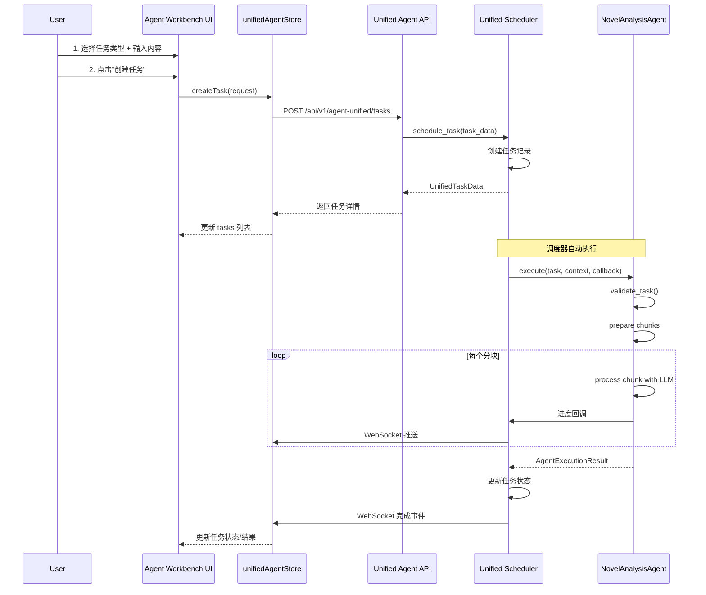
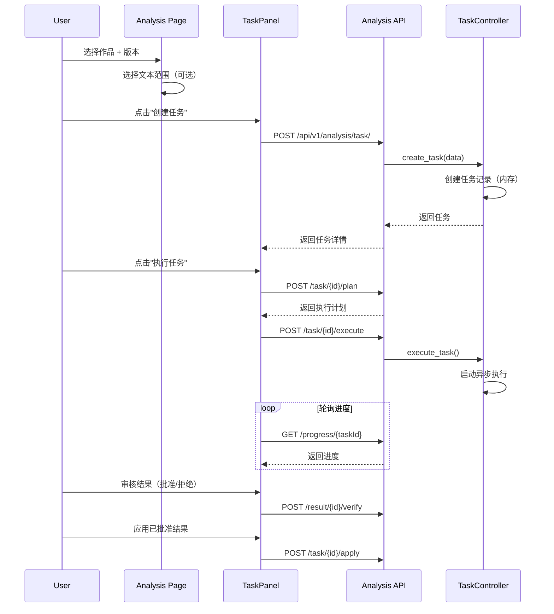
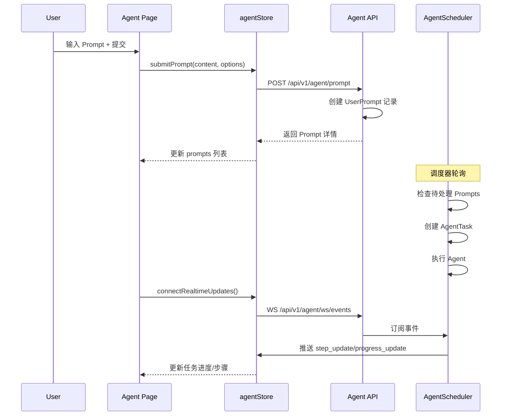

# Text Analysis Agent 系统代码分析文档

> **文档用途**: 重构前功能梳理与 API 盘点  
> **分析范围**: `agent.tsx`, `agent-workbench.tsx`, `analysis.tsx` 及相关后端 API  
> **创建日期**: 2026-03-01

---

## 目录

1. [架构概览](#1-架构概览)
2. [前端页面分析](#2-前端页面分析)
3. [核心工作流拆解](#3-核心工作流拆解)
4. [后端 API 列表](#4-后端-api-列表)
5. [数据模型](#5-数据模型)
6. [待清理/重构项](#6-待清理重构项)

---

## 1. 架构概览

### 1.1 系统现状

当前 Agent 系统存在 **两套并行实现**：

| 系统 | 路由 | 状态 | 用途 |
|------|------|------|------|
| **旧 Agent 系统** | `/api/v1/agent` | ⚠️ 过渡中 | Prompt-Task 模型，即将废弃 |
| **统一 Agent 系统** | `/api/v1/agent-unified` | ✅ 新系统 | 基于 Agent 注册表的任务调度 |
| **分析系统** | `/api/v1/analysis` | ✅ 活跃 | 小说分析专用 API |

### 1.2 前端页面分工

```
┌─────────────────────────────────────────────────────────────┐
│                     前端页面结构                             │
├─────────────────────────────────────────────────────────────┤
│  agent.tsx          →  旧版 Agent 入口（提交 Prompt）        │
│  agent-workbench.tsx → 新版统一工作台（推荐）               │
│  analysis.tsx       →  小说分析专用工作台                    │
└─────────────────────────────────────────────────────────────┘
```

---

## 2. 前端页面分析

### 2.1 agent.tsx（旧版 Agent 页面）

**文件路径**: `packages/site/src/pages/agent.tsx`

#### 功能模块

| 组件 | 功能描述 | 状态 |
|------|----------|------|
| `SchedulerStatusCard` | 显示调度器状态、统计、启动/停止控制 | 可复用 |
| `PromptInput` | 提交新 Prompt（支持类型选择、优先级） | 待迁移 |
| `TaskHistoryList` | 显示任务历史列表（合并 tasks + prompts） | 待迁移 |
| `TaskDetailPanel` | 任务详情（进度、步骤、输出、错误） | 可复用 |
| `QuickTemplates` | 快速模板选择（代码审查、数据分析等） | 可复用 |

#### 使用 Store

#### 核心 API
```typescript
// agentAPI - packages/site/src/lib/api/agent.ts
agentAPI.createPrompt(request)      // POST /api/v1/agent/prompt
agentAPI.listPrompts(params)        // GET  /api/v1/agent/prompt
agentAPI.cancelPrompt(id)           // POST /api/v1/agent/prompt/{id}/cancel
agentAPI.deletePrompt(id)           // DELETE /api/v1/agent/prompt/{id}
agentAPI.listTasks(params)          // GET  /api/v1/agent/task
agentAPI.getTask(id)                // GET  /api/v1/agent/task/{id}
agentAPI.cancelTask(id)             // POST /api/v1/agent/task/{id}/cancel
agentAPI.getSchedulerStatus()       // GET  /api/v1/agent/scheduler/status
agentAPI.startScheduler()           // POST /api/v1/agent/scheduler/start
agentAPI.stopScheduler()            // POST /api/v1/agent/scheduler/stop
agentAPI.connectEventStream()       // WS   /api/v1/agent/ws/events
```

---

### 2.2 agent-workbench.tsx（新版统一工作台）

**文件路径**: `packages/site/src/pages/agent-workbench.tsx`

#### 功能模块

| 组件 | 功能描述 | 对应 Tab |
|------|----------|----------|
| `Sidebar` | 左侧导航菜单（快速任务、小说分析、历史、设置） | - |
| `QuickTaskPanel` | 快速任务创建（通用对话、代码辅助、写作辅助） | quick |
| `NovelAnalysisPanel` | 小说分析入口（大纲提取、人物检测、设定提取、关系分析） | novel |
| `TaskMonitorPanel` | 任务监控（统计、筛选、列表、详情） | history |
| `CostDisplayPanel` | 成本概览与调度器控制 | - |
| `SettingsPanel` | 功能开关（统一 API 切换、Store 重置） | settings |

#### 任务类型映射
```typescript
// QuickTaskPanel 中的 subType 映射
{
  general: 'chat',
  code: 'code_review',
  writing: 'text_completion',
  novel_analysis: 'outline_extraction'
}

// NovelAnalysisPanel 中的分析类型
{
  outline_extraction: '大纲提取',
  character_detection: '人物检测',
  setting_extraction: '设定提取',
  relation_analysis: '关系分析'
}
```

#### 使用 Store

- `useUnifiedAgentStore` → `packages/site/src/lib/store/unifiedAgentStore.ts`

#### 核心 API
```typescript
// unifiedAgentAPI - packages/site/src/lib/api/unifiedAgent.ts
unifiedAgentAPI.createTask(request)         // POST /api/v1/agent-unified/tasks
unifiedAgentAPI.listTasks(filter)           // GET  /api/v1/agent-unified/tasks
unifiedAgentAPI.getTask(taskId)             // GET  /api/v1/agent-unified/tasks/{taskId}
unifiedAgentAPI.getTaskProgress(taskId)     // GET  /api/v1/agent-unified/tasks/{taskId}/progress
unifiedAgentAPI.cancelTask(taskId)          // POST /api/v1/agent-unified/tasks/{taskId}/cancel
unifiedAgentAPI.deleteTask(taskId)          // DELETE /api/v1/agent-unified/tasks/{taskId}
unifiedAgentAPI.listAgents()                // GET  /api/v1/agent-unified/agents
unifiedAgentAPI.getAgentInfo(agentType)     // GET  /api/v1/agent-unified/agents/{agentType}
unifiedAgentAPI.estimateTaskCost(...)       // POST /api/v1/agent-unified/agents/{agentType}/estimate
unifiedAgentAPI.getLLMConfig()              // GET  /api/v1/agent-unified/agents/config/llm
unifiedAgentAPI.getSchedulerStatus()        // GET  /api/v1/agent-unified/scheduler/status
unifiedAgentAPI.startScheduler()            // POST /api/v1/agent-unified/scheduler/start
unifiedAgentAPI.stopScheduler()             // POST /api/v1/agent-unified/scheduler/stop
unifiedAgentAPI.connectRealtimeStream()     // WS   /api/v1/agent-unified/ws/tasks
```

---

### 2.3 analysis.tsx（小说分析工作台）

**文件路径**: `packages/site/src/pages/analysis.tsx`

#### 功能架构

```
┌─────────────────────────────────────────────────────────────┐
│  Header: 作品选择器 + 版本选择器 + 统计概览                   │
├─────────────────────────────────────────────────────────────┤
│  Tabs:                                                      │
│    ├─ tasks    → TaskPanel + TextRangeSelector             │
│    ├─ characters → CharacterPanel                          │
│    ├─ settings → SettingPanel                              │
│    └─ outline  → OutlinePanel                              │
└─────────────────────────────────────────────────────────────┘
```

#### 核心组件

| 组件 | 文件路径 | 功能 |
|------|----------|------|
| `TextRangeSelector` | `packages/site/src/components/text_range_selector.tsx` | 文本范围选择（单章、范围、多选、整本） |
| `TaskPanel` | `packages/site/src/components/analysis/task_panel.tsx` | 分析任务管理（创建、执行、监控、审核） |
| `CharacterPanel` | `packages/site/src/components/analysis/character_panel.tsx` | 人物列表和分析 |
| `SettingPanel` | `packages/site/src/components/analysis/setting_panel.tsx` | 设定列表和管理 |
| `OutlinePanel` | `packages/site/src/components/analysis/outline_panel.tsx` | 大纲列表和编辑器 |

#### 使用 Store
- `useAnalysisStore` → `packages/site/src/lib/store/analysisStore.ts`

#### 核心 API（analysis.ts）

**文本范围 API**:
```typescript
api_preview_range(selection)        // POST /api/v1/analysis/range/preview
api_get_range_content(selection)    // POST /api/v1/analysis/range/content
api_get_selection_modes()           // GET  /api/v1/analysis/range/modes
```

**分析任务 API**:
```typescript
api_create_analysis_task(data)      // POST /api/v1/analysis/task/
api_get_tasks_by_edition(editionId) // GET  /api/v1/analysis/task/?edition_id={id}
api_get_analysis_task(taskId)       // GET  /api/v1/analysis/task/{taskId}
api_create_task_plan(taskId, mode)  // POST /api/v1/analysis/task/{taskId}/plan
api_execute_task_async(taskId, config) // POST /api/v1/analysis/task/{taskId}/execute
api_get_task_progress(taskId)       // GET  /api/v1/analysis/progress/{taskId}
api_cancel_running_task(taskId)     // POST /api/v1/analysis/task/{taskId}/cancel
api_apply_all_results(taskId)       // POST /api/v1/analysis/task/{taskId}/apply
```

**结果管理 API**:
```typescript
api_get_task_results(taskId)        // GET  /api/v1/analysis/result/{taskId}
api_approve_result(resultId)        // POST /api/v1/analysis/result/{resultId}/verify
api_reject_result(resultId)         // POST /api/v1/analysis/result/{resultId}/verify
```

**人物管理 API**:
```typescript
api_get_characters_by_edition(editionId, roleType)  // GET  /api/v1/analysis/character/edition/{editionId}
api_create_character(editionId, data)               // POST /api/v1/analysis/character/
api_delete_character(characterId)                   // DELETE /api/v1/analysis/character/{characterId}
api_get_character_profile(characterId)              // GET  /api/v1/analysis/character/{characterId}/profile
api_add_character_alias(characterId, alias, type)   // POST /api/v1/analysis/character/{characterId}/alias
api_remove_character_alias(aliasId)                 // DELETE /api/v1/analysis/character/alias/{aliasId}
api_add_character_attribute(...)                    // POST /api/v1/analysis/character/{characterId}/attribute
api_delete_character_attribute(attributeId)         // DELETE /api/v1/analysis/character/attribute/{attributeId}
api_get_relation_graph(editionId)                   // GET  /api/v1/analysis/edition/{editionId}/relation-graph
```

**设定管理 API**:
```typescript
api_get_settings_by_edition(editionId, settingType) // GET  /api/v1/analysis/setting/edition/{editionId}
api_create_setting(editionId, data)                 // POST /api/v1/analysis/setting/
api_delete_setting(settingId)                       // DELETE /api/v1/analysis/setting/{settingId}
api_get_setting_detail(settingId)                   // GET  /api/v1/analysis/setting/{settingId}/detail
api_get_setting_types()                             // GET  /api/v1/analysis/setting/types
api_add_setting_attribute(...)                      // POST /api/v1/analysis/setting/{settingId}/attribute
api_delete_setting_attribute(attributeId)           // DELETE /api/v1/analysis/setting/attribute/{attributeId}
```

**大纲管理 API**:
```typescript
api_get_outlines_by_edition(editionId, outlineType) // GET  /api/v1/analysis/outline/edition/{editionId}
api_create_outline(editionId, data)                 // POST /api/v1/analysis/outline/
api_delete_outline(outlineId)                       // DELETE /api/v1/analysis/outline/{outlineId}
api_get_outline_tree(outlineId)                     // GET  /api/v1/analysis/outline/{outlineId}/tree
api_add_outline_node(outlineId, data)               // POST /api/v1/analysis/outline/node
api_delete_outline_node(nodeId)                     // DELETE /api/v1/analysis/outline/node/{nodeId}
api_add_outline_event(nodeId, data)                 // POST /api/v1/analysis/outline/event
```

**证据管理 API**:
```typescript
api_create_evidence(data)           // POST /api/v1/analysis/evidence/
api_get_evidence(evidenceId)        // GET  /api/v1/analysis/evidence/{evidenceId}
api_update_evidence(evidenceId, data) // POST /api/v1/analysis/evidence/{evidenceId}
api_delete_evidence(evidenceId)     // DELETE /api/v1/analysis/evidence/{evidenceId}
api_get_chapter_evidence(nodeId, evidenceType) // GET  /api/v1/analysis/evidence/chapter/{nodeId}
api_get_target_evidence(targetType, targetId)  // GET  /api/v1/analysis/evidence/target/{targetType}/{targetId}
```

**大纲提取专用 API**:
```typescript
api_create_outline_extraction_task(data)    // POST /api/v1/analysis/outline-extraction/
api_get_outline_extraction_progress(taskId) // GET  /api/v1/analysis/outline-extraction/task/{taskId}
api_get_outline_extraction_detailed_status(taskId) // GET  /api/v1/analysis/outline-extraction/task/{taskId}/detailed
api_resume_outline_extraction_task(taskId)  // POST /api/v1/analysis/outline-extraction/task/{taskId}/resume
api_get_outline_extraction_result(taskId)   // GET  /api/v1/analysis/outline-extraction/task/{taskId}/result
api_save_outline_extraction_result(taskId)  // POST /api/v1/analysis/outline-extraction/task/{taskId}/save
api_preview_outline_extraction(data)        // POST /api/v1/analysis/outline-extraction/preview
api_get_edition_outline_tasks(editionId)    // GET  /api/v1/analysis/outline-extraction/tasks/edition/{editionId}
```

**LLM Provider API**:
```typescript
api_get_llm_providers()             // GET  /api/v1/analysis/llm-providers
```

---

## 3. 核心工作流拆解

### 3.1 统一 Agent 任务工作流（agent-workbench）



### 3.2 小说分析任务工作流（analysis.tsx）



### 3.3 旧版 Agent Prompt 工作流（agent.tsx）



---

## 4. 后端 API 列表

### 4.1 统一 Agent API（/api/v1/agent-unified）

**路由文件**: `sail_server/router/unified_agent.py`

| 方法 | 路径 | 功能 | Controller |
|------|------|------|------------|
| POST | `/tasks` | 创建新任务 | UnifiedTaskController.create_task |
| GET | `/tasks` | 获取任务列表 | UnifiedTaskController.list_tasks |
| GET | `/tasks/{task_id}` | 获取任务详情 | UnifiedTaskController.get_task |
| GET | `/tasks/{task_id}/progress` | 获取任务进度 | UnifiedTaskController.get_task_progress |
| POST | `/tasks/{task_id}/cancel` | 取消任务 | UnifiedTaskController.cancel_task |
| DELETE | `/tasks/{task_id}` | 删除任务 | UnifiedTaskController.delete_task |
| GET | `/agents` | 列出所有 Agent | UnifiedAgentInfoController.list_agents |
| GET | `/agents/{agent_type}` | 获取 Agent 详情 | UnifiedAgentInfoController.get_agent_info |
| POST | `/agents/{agent_type}/estimate` | 预估任务成本 | UnifiedAgentInfoController.estimate_task_cost |
| GET | `/agents/config/llm` | 获取 LLM 配置 | UnifiedAgentInfoController.get_llm_config |
| GET | `/scheduler/status` | 获取调度器状态 | UnifiedSchedulerController.get_scheduler_status |
| POST | `/scheduler/start` | 启动调度器 | UnifiedSchedulerController.start_scheduler |
| POST | `/scheduler/stop` | 停止调度器 | UnifiedSchedulerController.stop_scheduler |
| WS | `/ws/tasks` | WebSocket 实时流 | TaskProgressWebSocket |

### 4.2 旧版 Agent API（/api/v1/agent）

**路由文件**: `sail_server/router/agent.py`

| 方法 | 路径 | 功能 | Controller |
|------|------|------|------------|
| POST | `/prompt` | 创建 Prompt | UserPromptController.create_prompt |
| GET | `/prompt` | 获取 Prompt 列表 | UserPromptController.list_prompts |
| GET | `/prompt/{id}` | 获取 Prompt 详情 | UserPromptController.get_prompt |
| POST | `/prompt/{id}/cancel` | 取消 Prompt | UserPromptController.cancel_prompt |
| DELETE | `/prompt/{id}` | 删除 Prompt | UserPromptController.delete_prompt |
| GET | `/task` | 获取任务列表 | AgentTaskController.list_tasks |
| GET | `/task/{id}` | 获取任务详情 | AgentTaskController.get_task |
| GET | `/task/{id}/steps` | 获取任务步骤 | AgentTaskController.get_task_steps |
| POST | `/task/{id}/cancel` | 取消任务 | AgentTaskController.cancel_task |
| GET | `/scheduler/status` | 获取调度器状态 | SchedulerController.get_status |
| POST | `/scheduler/start` | 启动调度器 | SchedulerController.start_scheduler |
| POST | `/scheduler/stop` | 停止调度器 | SchedulerController.stop_scheduler |
| POST | `/scheduler/config` | 更新调度器配置 | SchedulerController.update_config |
| WS | `/ws/events` | WebSocket 事件流 | agent_event_websocket |

### 4.3 分析 API（/api/v1/analysis）

**路由文件**: `sail_server/router/analysis.py`

| 分类 | 方法 | 路径 | 功能 | Controller |
|------|------|------|------|------------|
| 范围 | POST | `/range/preview` | 预览文本范围 | TextRangeController.preview_range |
| 范围 | POST | `/range/content` | 获取文本内容 | TextRangeController.get_range_content |
| 范围 | GET | `/range/modes` | 获取选择模式 | TextRangeController.get_selection_modes |
| 证据 | POST | `/evidence/` | 创建证据 | EvidenceController.create_evidence |
| 证据 | GET | `/evidence/{id}` | 获取证据 | EvidenceController.get_evidence |
| 证据 | POST | `/evidence/{id}` | 更新证据 | EvidenceController.update_evidence |
| 证据 | DELETE | `/evidence/{id}` | 删除证据 | EvidenceController.delete_evidence |
| 证据 | GET | `/evidence/chapter/{node_id}` | 获取章节证据 | EvidenceController.get_chapter_evidence |
| 证据 | GET | `/evidence/target/{type}/{id}` | 获取目标证据 | EvidenceController.get_target_evidence |
| 统计 | GET | `/stats/{edition_id}` | 获取统计 | AnalysisStatsController.get_stats |
| 任务 | POST | `/task/` | 创建任务 | TaskController.create_task |
| 任务 | GET | `/task/` | 获取任务列表 | TaskController.list_tasks |
| 任务 | GET | `/task/{id}` | 获取任务详情 | TaskController.get_task |
| 任务 | POST | `/task/{id}/cancel` | 取消任务 | TaskController.cancel_task |
| 任务 | DELETE | `/task/{id}` | 删除任务 | TaskController.delete_task |
| 任务 | POST | `/task/{id}/plan` | 创建执行计划 | TaskController.create_task_plan |
| 任务 | POST | `/task/{id}/execute` | 执行任务 | TaskController.execute_task |
| 任务 | POST | `/task/{id}/apply` | 应用结果 | TaskController.apply_results |
| 进度 | GET | `/progress/{task_id}` | 获取进度 | ProgressController.get_progress |
| 结果 | GET | `/result/{task_id}` | 获取结果 | ResultController.get_results |
| 结果 | POST | `/result/{id}/verify` | 审核结果 | ResultController.verify_result |
| LLM | GET | `/llm-providers` | 获取 Providers | LLMProviderController.get_providers |
| 人物 | GET | `/character/edition/{edition_id}` | 获取人物列表 | CharacterController.list_by_edition |
| 人物 | POST | `/character/` | 创建人物 | CharacterController.create_character |
| 人物 | DELETE | `/character/{id}` | 删除人物 | CharacterController.delete_character |
| 人物 | GET | `/character/{id}/profile` | 获取人物详情 | CharacterController.get_profile |
| 人物 | POST | `/character/{id}/alias` | 添加别名 | CharacterController.add_alias |
| 人物 | DELETE | `/character/alias/{id}` | 删除别名 | CharacterController.remove_alias |
| 人物 | POST | `/character/{id}/attribute` | 添加属性 | CharacterController.add_attribute |
| 人物 | DELETE | `/character/attribute/{id}` | 删除属性 | CharacterController.delete_attribute |
| 设定 | GET | `/setting/edition/{edition_id}` | 获取设定列表 | SettingController.list_by_edition |
| 设定 | POST | `/setting/` | 创建设定 | SettingController.create_setting |
| 设定 | DELETE | `/setting/{id}` | 删除设定 | SettingController.delete_setting |
| 设定 | GET | `/setting/{id}/detail` | 获取设定详情 | SettingController.get_detail |
| 设定 | GET | `/setting/types` | 获取设定类型 | SettingController.get_types |
| 设定 | POST | `/setting/{id}/attribute` | 添加属性 | SettingController.add_attribute |
| 设定 | DELETE | `/setting/attribute/{id}` | 删除属性 | SettingController.delete_attribute |
| 大纲 | GET | `/outline/edition/{edition_id}` | 获取大纲列表 | OutlineController.list_by_edition |
| 大纲 | POST | `/outline/` | 创建大纲 | OutlineController.create_outline |
| 大纲 | DELETE | `/outline/{id}` | 删除大纲 | OutlineController.delete_outline |
| 大纲 | GET | `/outline/{id}/tree` | 获取大纲树 | OutlineController.get_tree |
| 大纲 | POST | `/outline/node` | 添加节点 | OutlineController.add_node |
| 大纲 | DELETE | `/outline/node/{id}` | 删除节点 | OutlineController.delete_node |
| 大纲 | POST | `/outline/event` | 添加事件 | OutlineController.add_event |
| 关系 | GET | `/edition/{id}/relation-graph` | 获取关系图 | CharacterController.get_relation_graph |
| 大纲提取 | POST | `/outline-extraction/` | 创建提取任务 | OutlineExtractionController.create_task |
| 大纲提取 | GET | `/outline-extraction/task/{id}` | 获取进度 | OutlineExtractionController.get_progress |
| 大纲提取 | GET | `/outline-extraction/task/{id}/detailed` | 获取详细状态 | OutlineExtractionController.get_detailed_status |
| 大纲提取 | POST | `/outline-extraction/task/{id}/resume` | 恢复任务 | OutlineExtractionController.resume_task |
| 大纲提取 | GET | `/outline-extraction/task/{id}/result` | 获取结果 | OutlineExtractionController.get_result |
| 大纲提取 | POST | `/outline-extraction/task/{id}/save` | 保存结果 | OutlineExtractionController.save_result |
| 大纲提取 | POST | `/outline-extraction/preview` | 预览提取 | OutlineExtractionController.preview |
| 大纲提取 | GET | `/outline-extraction/tasks/edition/{id}` | 获取任务列表 | OutlineExtractionController.list_by_edition |

---

## 5. 数据模型

### 5.1 统一 Agent 数据模型

**文件**: `sail_server/data/unified_agent.py`

```python
class UnifiedAgentTask(Base):
    """统一 Agent 任务模型"""
    __tablename__ = "unified_agent_tasks"
    
    id: Mapped[int] = mapped_column(primary_key=True)
    task_type: Mapped[str]                    # 任务类型
    sub_type: Mapped[Optional[str]]           # 子类型
    edition_id: Mapped[Optional[int]]         # 关联版本
    target_node_ids: Mapped[Optional[list]]   # 目标节点
    status: Mapped[str]                       # pending/running/completed/failed/cancelled
    priority: Mapped[int]                     # 优先级 1-10
    progress: Mapped[int]                     # 进度 0-100
    current_phase: Mapped[Optional[str]]      # 当前阶段
    llm_provider: Mapped[Optional[str]]       # LLM 提供商
    llm_model: Mapped[Optional[str]]          # LLM 模型
    config: Mapped[Optional[dict]]            # 配置参数
    result_data: Mapped[Optional[dict]]       # 结果数据
    error_message: Mapped[Optional[str]]      # 错误信息
    estimated_tokens: Mapped[Optional[int]]   # 预估 token
    actual_tokens: Mapped[int]                # 实际 token
    estimated_cost: Mapped[Optional[float]]   # 预估成本
    actual_cost: Mapped[float]                # 实际成本
    created_at, started_at, completed_at, cancelled_at  # 时间戳

class UnifiedTaskStep(Base):
    """任务步骤模型"""
    __tablename__ = "unified_task_steps"
    
    id: Mapped[int] = mapped_column(primary_key=True)
    task_id: Mapped[int]
    step_number: Mapped[int]
    step_type: Mapped[str]                    # llm_call/data_processing/verification/error
    title: Mapped[str]
    content: Mapped[Optional[str]]
    llm_provider: Mapped[Optional[str]]
    llm_model: Mapped[Optional[str]]
    prompt_tokens: Mapped[int]
    completion_tokens: Mapped[int]
    total_tokens: Mapped[int]
    cost: Mapped[float]
    status: Mapped[str]                       # pending/running/completed/failed
    meta_data: Mapped[Optional[dict]]
    created_at, started_at, completed_at
```

### 5.2 旧版 Agent 数据模型

**文件**: `sail_server/data/agent.py`

```python
class UserPrompt(Base):
    """用户 Prompt 模型"""
    __tablename__ = "user_prompts"
    
    id: Mapped[int] = mapped_column(primary_key=True)
    content: Mapped[str]                      # Prompt 内容
    prompt_type: Mapped[str]                  # 类型
    context: Mapped[Optional[dict]]           # 上下文
    priority: Mapped[int]
    status: Mapped[str]                       # pending/scheduled/processing/completed/failed/cancelled
    session_id: Mapped[Optional[str]]
    parent_prompt_id: Mapped[Optional[int]]
    created_at, scheduled_at, started_at, completed_at

class AgentTask(Base):
    """Agent 任务模型"""
    __tablename__ = "agent_tasks"
    
    id: Mapped[int] = mapped_column(primary_key=True)
    prompt_id: Mapped[int]
    agent_type: Mapped[str]
    agent_config: Mapped[Optional[dict]]
    status: Mapped[str]                       # created/preparing/running/paused/completed/failed/cancelled
    progress: Mapped[int]
    error_message: Mapped[Optional[str]]
    error_code: Mapped[Optional[str]]
    created_at, started_at, updated_at, completed_at

class AgentStep(Base):
    """Agent 步骤模型"""
    __tablename__ = "agent_steps"
    
    id: Mapped[int] = mapped_column(primary_key=True)
    task_id: Mapped[int]
    step_number: Mapped[int]
    step_type: Mapped[str]                    # thought/action/observation/error/completion
    title: Mapped[Optional[str]]
    content: Mapped[Optional[str]]
    content_summary: Mapped[Optional[str]]
    meta_data: Mapped[Optional[dict]]
    created_at, duration_ms

class AgentOutput(Base):
    """Agent 输出模型"""
    __tablename__ = "agent_outputs"
    
    id: Mapped[int] = mapped_column(primary_key=True)
    task_id: Mapped[int]
    output_type: Mapped[str]                  # text/code/file/json/error
    content: Mapped[Optional[str]]
    file_path: Mapped[Optional[str]]
    meta_data: Mapped[Optional[dict]]
    review_status: Mapped[str]                # pending/approved/rejected
    reviewed_by, reviewed_at, review_notes
    created_at
```

### 5.3 前端 TypeScript 类型

**统一 Agent 类型**: `packages/site/src/lib/api/unifiedAgent.ts`

```typescript
interface UnifiedTask {
  id: number
  taskType: TaskType          // 'novel_analysis' | 'code' | 'writing' | 'general'
  subType?: TaskSubType
  status: TaskStatus          // 'pending' | 'running' | 'completed' | 'failed' | 'cancelled'
  progress: number
  currentPhase?: string
  priority: number
  estimatedTokens?: number
  actualTokens: number
  estimatedCost?: number
  actualCost: number
  createdAt: string
  startedAt?: string
  completedAt?: string
  errorMessage?: string
  resultData?: Record<string, unknown>
}

interface TaskStep {
  id: number
  taskId: number
  stepType: 'llm_call' | 'data_processing' | 'verification' | 'error'
  stepName: string
  status: 'pending' | 'running' | 'completed' | 'failed'
  llmProvider?: string
  llmModel?: string
  promptTokens: number
  completionTokens: number
  totalTokens: number
  cost: number
  startedAt?: string
  completedAt?: string
}

interface AgentEvent {
  eventType: 'task_created' | 'task_started' | 'task_progress' | 'task_step' | 
             'task_completed' | 'task_failed' | 'task_cancelled' | 'cost_update'
  taskId: number
  timestamp: string
  data: Record<string, unknown>
}
```

---

## 6. 待清理/重构项

### 6.1 前端待清理

| 优先级 | 项目 | 说明 |
|--------|------|------|
| 🔴 高 | `agent.tsx` | 旧版 Agent 页面，功能已迁移到 `agent-workbench.tsx`，可废弃 |
| 🔴 高 | `agentStore.ts` | 旧版 Store，依赖旧 API，可废弃 |
| 🔴 高 | `agent.ts` (API) | 旧版 API 客户端，可废弃 |
| 🟡 中 | `analysis.tsx` | 部分代码为桩实现（stub），需要完善 |
| 🟡 中 | `task_panel.tsx` | 任务执行流程需要与统一 Agent 系统整合 |
| 🟢 低 | `analysisStore.ts` | 部分方法为 TODO，需要实现 |

### 6.2 后端待清理

| 优先级 | 项目 | 说明 |
|--------|------|------|
| 🔴 高 | `router/agent.py` | 旧版 Agent 路由，可废弃 |
| 🔴 高 | `model/agent/` | 旧版 Agent 调度器模型 |
| 🔴 高 | `data/agent.py` | 旧版 Agent 数据模型 |
| 🟡 中 | `controller/analysis.py` | TaskController 为桩实现 |
| 🟡 中 | `analysis_compat.py` | 兼容性路由，确认无用后删除 |
| 🟢 低 | `agent_compat.py` | 兼容性路由，确认无用后删除 |

### 6.3 API 整合建议

当前三套 API 存在大量功能重叠，建议整合路径：

```
┌─────────────────────────────────────────────────────────────┐
│                    整合后架构                                │
├─────────────────────────────────────────────────────────────┤
│                                                             │
│   ┌──────────────────┐    ┌──────────────────┐             │
│   │  统一 Agent API  │    │  分析专用 API    │             │
│   │  /agent-unified  │    │  /analysis       │             │
│   └────────┬─────────┘    └────────┬─────────┘             │
│            │                       │                       │
│            ▼                       ▼                       │
│   ┌──────────────────┐    ┌──────────────────┐             │
│   │  Agent Registry  │    │  分析 Controllers │             │
│   │  任务调度系统     │    │  (人物/设定/大纲) │             │
│   └────────┬─────────┘    └────────┬─────────┘             │
│            │                       │                       │
│            └───────────┬───────────┘                       │
│                        ▼                                   │
│              ┌──────────────────┐                         │
│              │   统一数据库层    │                         │
│              │  统一 Agent Task │                         │
│              └──────────────────┘                         │
│                                                             │
└─────────────────────────────────────────────────────────────┘
```

### 6.4 需要保留的核心功能

1. **任务管理**: 创建、取消、删除、进度追踪
2. **调度器控制**: 启动/停止、状态监控
3. **WebSocket 实时更新**: 任务状态推送
4. **文本范围选择**: 多种模式（单章、范围、多选、整本）
5. **小说分析**: 大纲提取、人物检测、设定提取
6. **结果审核**: 批准/拒绝/应用
7. **成本追踪**: Token 消耗、成本计算

---

**文档结束**

> 本文档为重构前代码梳理，所有文件路径均为相对项目根目录的完整路径。
